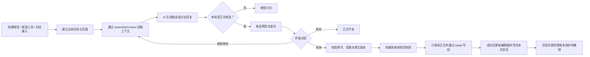

# StoryForge 正文编辑器与 AI 协作设计

> 状态：需求实现与自动回归完成；Windows 真实交互签字待补（见 §15）<br>
> 最近更新：2026-07-19<br>
> 适用范围：章节正文工作区、框选修改、正文生成/续写、AI 多轮修订与候选采纳<br>
> 上位约束：[`CLAUDE.md`](../CLAUDE.md) → [`MASTER-BLUEPRINT.md`](./MASTER-BLUEPRINT.md) → 本文

本文记录正文编辑器重构背后的产品判断、交互边界和可验收需求。它解释“为什么这样设计”和“完成后必须表现为何种行为”，不替代由代码生成的 AI 功能清单，也不复制 `CONTEXT_SOURCES`、`FIELD_REGISTRY` 或 `PROJECT_TABLES` 的代码事实。

文中需求使用 `CAE-<施工包>-<序号>` 标识。状态词固定为：

- `已验证`：代码、自动化回归和对应真实路径证据均成立；
- `已实现待验收`：工作区已有实现，但证据尚未达到本文完成标准；
- `未实现`：设计已经确定，尚未形成完整业务实现；
- `待决策`：仍会改变数据模型或用户行为，不能由实施者自行猜测。

如果本文与代码行为不一致，应先判断是实现遗漏还是设计已经变更；不得静默按任一方猜测。用户可见行为变更需同步更新本文、[`AI-FUNCTIONS-MANUAL.semantic.md`](./AI-FUNCTIONS-MANUAL.semantic.md) 与 [`CHANGELOG.md`](../CHANGELOG.md)。

---

## 一、产品定位

StoryForge 不是“传统码字器加几个 AI 按钮”，也不是只有聊天记录的 ChatGPT 外壳。

正文工作区中的分工是：

- **AI 是主要内容生产力**：负责根据章纲和项目资料生成、续写、改写与修订正文。
- **作者是导演、审稿人和最终决策者**：提出目标或修订意见，核对 AI 使用的资料，比较候选，决定采纳、退回或继续修改。
- **编辑器是审阅与落稿现场**：正文必须始终可见、可直接编辑；AI 面板不能取代稿件，也不能未经确认覆盖稿件。

一句话定义：

> 让 AI 依据长篇项目的真实上下文持续生产正文，让作者以最低操作成本审阅、追改并安全采纳。

### 使用场景

作者在桌面电脑前连续工作数小时，中央区域长期阅读当前章节，左侧在章节间切换，右侧只在需要生成、核对或修订时展开 AI 协作。界面应安静、稳定、低装饰，减少视觉疲劳和面板切换。

“作家助手”是正文工作区的直接体验参考，借鉴的是：

- 稿件居中且占据主空间；
- 目录和工具各司其职；
- 操作紧凑、装饰克制；
- AI 在需要时出现，不用彩色按钮包围正文。

不照搬其品牌、颜色或具体组件。StoryForge 继续使用自身设计系统，并以默认暖白编辑室作为新界面的视觉基准。

---

## 二、旧体验的问题

此前正文页同时存在三套互相割裂的 AI 入口：

1. 顶部固定按钮直接调用一套内置提示词；
2. 框选文字后的浮动工具调用另一套局部修改；
3. 右侧或底部对话又走一套独立问答。

这会产生五类问题：

- 用户不知道同名动作实际读取了哪些资料、会修改哪里；
- “生成正文”不能自然补充本轮要求，只能反复抽卡；
- 框选修改只把选中文字交给 AI，丢失人物、前后文、章纲和长期设定；
- 对话只能给建议或只能改正文，讨论和产出之间边界含混；
- 结果散落在不同面板，无法围绕同一候选继续追改。

因此，本次重构不是给旧按钮增加一个输入框，而是统一正文页的 AI 任务模型。

---

## 三、统一任务模型

正文页所有 AI 入口都必须收口为同一个任务：

```text
作者意图
  + 可写目标（整章或选区）
  + 只读上下文（章纲、整章、项目资料、连续性记忆）
  + 当前候选与对话历史
  → AI 候选
  → 作者继续追改 / 采纳 / 放弃
  → 统一写回
```

顶部快捷按钮、框选浮动工具和对话输入框只是进入同一任务的不同方式，不得各自复制业务逻辑。

### 核心对象

| 对象 | 含义 | 是否允许 AI 直接修改 |
|---|---|---|
| 只读上下文 | 整章正文、章纲、细纲、角色、世界观、事实、状态、前情等 | 否 |
| 可写目标 | 本轮允许落稿的范围：整章或一个固定选区 | 仅生成候选，不直接写入 |
| 作者指令 | 本轮目标、意见或问题 | 不适用 |
| 当前候选 | AI 本轮产出的待采纳正文 | 否，必须经作者确认 |
| 已保存正文 | 当前章节的正式内容 | 只有作者采纳后才能写回 |

### 统一流程



### 正文变化的统一闭环

所有生成、续写、整章改写和选区修改都必须遵循同一条安全闭环：

```text
建立任务范围
→ 解析本轮真实模型
→ 装配作者眼前的真实正文与项目上下文
→ 讨论或生成候选
→ 审阅 / 继续修改 / 放弃
→ 采纳前版本校验
→ 创建项目快照
→ adopt() 原子写回
→ 成功后清空本次会话
→ 会话外提供独立撤销
```

任何一步失败都不得修改正式正文，也不得清空候选、指令或对话。

---

## 四、生成正文：默认直接生成，要求按需补充

不是每次生成正文都需要作者额外写要求。

### 默认路径

“生成正文”主按钮直接使用：

- 当前章章纲；
- 当前章关联的场景细纲；
- 项目设定和角色资料；
- 上一章交接、真实结尾和近期章节记忆；
- 当前有效事实、状态、物品和相关前文；
- 当前启用的默认提示词模板。

默认指令的语义是：严格按照本章章纲与项目设定生成可直接审阅的正文。

### 带要求生成

主按钮旁提供次级入口，用于：

- 补充本轮特殊要求；
- 调整模板暴露的参数；
- 查看或覆盖本轮 Prompt。

额外要求只影响本次运行，不应静默修改当前启用的全局模板。

### 章纲前置

章纲是正文生产的硬依据，而不是普通参考资料。

- 当前章节没有关联章纲，或章纲摘要为空时，生成和续写必须暂停；
- 界面解释暂停原因，并提供“打开章纲”的直接入口；
- 不允许在资料缺失时让模型自行补完世界、人物和第一章任务后继续盲写；
- 场景细纲是可选增强，不是生成前置；不存在或没有有效场景时，仍按章纲正常生成；
- 细纲记录存在但没有有效场景时，界面显示“无有效细纲”，不得把空记录伪装成已读取依据；
- 细纲关联到错误章节、节点不存在或引用损坏时，提示修复关联，不得把错误细纲注入当前任务；
- 存在有效细纲时必须完整注入并保护，至少覆盖场景顺序、标题、摘要、人物、地点、冲突、节奏、预计字数、作者备注、开头衔接、结尾悬念、情绪走向和关联伏笔；人物与伏笔 ID 必须解析为作者可理解的名称，不只把裸 ID 交给模型。

`requiredSourceKeys` 不能同时承担“业务必需”和“存在时不得裁剪”两种含义。正文生成的章纲硬前置由业务层单独校验；装配层应使用语义明确的 `protectedSourceKeys`（或等价字段）表达“来源存在时完整保护”。

| 细纲状态 | 生成行为 | UI 说明 |
|---|---|---|
| 不存在 | 按章纲正常生成 | 未使用细纲 |
| 存在但无有效场景 | 按章纲正常生成 | 无有效细纲 |
| 存在有效场景 | 完整注入并保护 | 已读取 N 个场景 |
| 关联损坏 | 不注入错误记录 | 细纲关联异常，提供修复入口 |

---

## 五、修改范围：无选区整章，有选区锁定选区

### 范围规则

| 当前状态 | AI 可读取 | AI 可产出的正文候选 | 采纳结果 |
|---|---|---|---|
| 未框选正文 | 整章 + 章纲 + 项目资料 | 完整整章 | 替换整章 |
| 已框选正文 | 整章 + 章纲 + 项目资料 + 选区邻文 | 只包含选区内部的替换正文 | 只替换原选区 |
| 讨论模式 | 与当前任务相同的只读上下文 | 建议、分析或回答 | 不提供正文写回 |
| 续写任务 | 已有整章 + 章纲 + 项目资料 | 只包含追加内容 | 追加到章节末尾 |

无选区时，用户输入“把这一章写得更克制”“重新安排本章节奏”等产出型指令，默认以整章为可写目标。界面必须明确显示“修改范围：整章正文”，不能让用户靠猜。

### 读写范围必须分离

框选只限制“可以写回哪里”，不能限制“AI 能看见什么”。

如果框选后只把选区交给 AI，模型会失去：

- 角色在本章中的语气和状态；
- 选区前后的动作、指代和节奏；
- 本章目标与场景任务；
- 已确认事实和长期连续性。

因此，选区任务仍读取完整上下文，但 Prompt 必须把上下文标为只读，把选区标为唯一可写目标。

这不会允许 AI 多改正式正文，因为“模型能看到的内容”和“系统允许落稿的范围”由两层机制分别控制。

---

## 六、选区硬边界与“AI 会不会多改”

模型可能输出超出要求的内容，因此不能只依赖 Prompt 自律。

### 第一层：生成契约

选区任务向模型明确提供：

- 项目只读上下文；
- 当前章节完整正文（只读）；
- 目标前邻文（只读，不得输出）；
- 本轮可写目标；
- 目标后邻文（只读，不得输出）；
- 只输出替换正文的交付协议。

### 第二层：候选越界检查

如果候选包含以下内容，不提供采纳入口：

- Prompt 区块或标签；
- 选区前邻文结尾的连续回显；
- 选区后邻文开头的连续回显；
- 空白或无法作为替换正文的结果。

### 第三层：写回硬校验

采纳时重新验证：

- 任务仍属于建立时的 `projectId + chapterId`；
- 当前章节完整正文 hash 与生成候选时记录的版本一致；
- 原选区坐标仍然有效；
- 原选区文字与生成时一致；
- 正文没有在等待期间导致目标位置失效；
- 写回模式被强制为 `replace-selection`。

任一条件失败，本次不写入，候选仍保留供作者查看或复制。

### 边界的真实含义

系统能保证 AI 不修改选区外正文，但不能仅靠范围规则保证 AI 在选区内部只改一个词或只做轻微润色。选区内部的修改强度属于另一个维度，后续应通过以下方式控制：

- 明确的“轻微润色 / 结构改写 / 自由重写”强度；
- 原文与候选差异视图；
- 修改幅度异常提示；
- 作者确认后才采纳。

范围保护不能被误写成“语义上绝不会多改”的承诺。

---

## 七、框选工具不是第二套 AI

浮动工具条只负责两件事：

1. 捕获并锁定当前选区；
2. 预填作者的修改意图。

“润色、扩写、缩写、改写、查漏、问 AI”都应进入同一个 AI 协作面板，围绕同一个选区继续交流。浮动工具条本身不维护独立结果区，也不直接把模型输出写回编辑器。

### 框选交互要求

- 选区达到最小有效长度后显示工具条；
- 工具条出现后，点击其中按钮不能导致选区先失焦消失；
- 选区改变时更新范围；
- 用户主动关闭时，只关闭工具条，不修改正文；
- 已有未采纳候选时切换到新选区，必须先提示旧候选会被放弃；
- 进入协作面板后，即使浏览器原生选区视觉消失，任务仍使用已保存的选区快照；
- 用户可显式“切换为整章”，但不能在不提示的情况下自动扩大范围。

### 持续范围高亮

进入选区任务后，正文必须用 TipTap / ProseMirror Decoration 持续显示本轮唯一可写范围：

- 标记只存在于编辑器视图，不写入正文 HTML、不进入 IndexedDB、不影响导出；
- 正常锁定使用浅强调背景；生成中增加轻量边界状态；范围失效使用警告状态并禁用采纳；
- 成功采纳、放弃任务、切换整章、切换章节或选择新范围时清除；
- 讨论与多轮追改期间始终保留，不能只依赖浏览器原生选区。

### 长选区与工具条恢复

- 小于最小长度时可以不显示工具条；超过局部修改上限时必须显示明确提示，例如“当前选区 7,318 字，超过局部修改上限。请缩小范围或切换为整章修改”，不能静默消失；
- 用户关闭同一选区的工具条后，折叠再重新选择、编辑器失焦后返回、重新拖选同一段或当前 AI 任务结束时，都必须允许工具条再次出现；
- 工具条的关闭状态属于一次展示周期，不得永久绑定到 `from + to + text`。

---

## 八、对话的边界

对话既能讨论，也能产出候选，但二者必须在结果用途上明确区分。

### 讨论

适合：

- “这段节奏为什么不对？”
- “这个角色现在的动机成立吗？”
- “给我三种处理方向，不要改正文。”

讨论回复只进入对话记录，不提供采纳到正文的主动作。

### 产出修改

适合：

- “把这段对白改得更克制。”
- “重写这一章，让冲突更早发生。”
- “沿用第二个方案，直接给我替换稿。”

产出结果进入候选区，并继承当前可写范围。选区任务无论经过多少轮对话，都不得自动扩大为整章；整章任务也不能因为回答中引用局部内容而缩小范围。

### 自动判断与人工兜底

默认模式可以根据指令判断讨论或产出，但作者必须可以显式选择“只讨论”或“产出修改”。系统判断不确定时，应优先不写入，而不是把建议误当正文。

自动判断遵循以下优先级：

1. 明确修改动词优先判定为产出，即使句子以“能不能”“可以吗”结尾；
2. 评价、原因、方向、分析和方案比较类问句判定为讨论；
3. 输入框旁实时显示“本轮将生成选区/整章候选”或“本轮只进行讨论”；
4. 作者可在发送前显式切换，显式选择永远覆盖自动判断。

“这段能不能更紧凑”“可以帮我重写一下吗”“把刚才说的问题直接改掉”都应判定为产出；“为什么不紧凑”“有哪些修改方向”应判定为讨论。

### 讨论后直接转为修改

围绕选区的讨论回复下提供：

```text
[按建议修改] [润色] [扩写] [缩写] [重新改写]
```

点击后继续使用原选区与已有讨论，自动切换为候选产出，不要求作者重新框选。输入区明确显示：

> 当前锁定原选区。可以继续讨论，也可以直接让 AI 修改这段。

无论对话经过多少轮，写回范围都只能是原选区；快捷动作改变的是意图，不改变边界。

---

## 九、上下文透明度

作者不需要阅读完整 Prompt 才能知道 AI 使用了什么，但必须能检查生成依据。

AI 协作面板至少显示：

- **修改范围**：整章、选区字数或续写位置；
- **读取范围**：整章、章纲和项目资料；
- **实际模型**：本轮路由后的 provider、model、上下文窗口和输出上限；
- **实际读取来源**：最近一次装配成功的来源清单及估算 token；
- **缺失来源**：本轮没有内容的来源；
- **来源自身限额**：单个来源因自身软上限被截断或摘要；
- **总窗口裁剪**：因真实模型窗口不足而整段省略的来源；
- **AI 语义压缩**：经受控摘要保留结构或实体清单的来源。

面板应能表达类似信息：

> 创作模型：LongCat-2.0<br>
> 上下文窗口：1,000,000 token<br>
> 本次输入：18,420 token<br>
> 输出上限：32,000 token

来源自身限额、总窗口裁剪和 AI 语义压缩必须使用不同状态与文案，不能都显示成“预算压缩”。如果真实模型窗口为 1,000,000 token，不得因未解析路由或错误 fallback 按 8K/2K 提前删除来源。

### 模型解析与装配顺序

上下文装配和请求发送必须共享同一个真实请求配置：

```text
确定本轮 category
→ resolveRequestConfig()
→ 得到实际 provider / model / contextWindowTokens / maxOutputTokens
→ 使用该配置 assembleContext()
→ 使用同一配置发送请求
```

不得先用设置页全局模型装配、再在发送时切换到任务路由模型。固定来源上限应随窗口档位动态放宽；超长来源优先做相关性筛选、结构化摘要或受控语义压缩，避免简单从尾部切断。

### 请求前的生成依据

第一次生成前，面板先显示准备读取的来源、缺失来源、受保护来源、修改范围和实际模型；默认生成仍一键执行，不增加强制确认。装配完成后，这一区域更新为“本次实际读取”，并区分计划与实际结果。

章纲、连续性交接和真实前章结尾属于正文生成的保护来源，不能在普通预算裁剪中静默消失。其余来源按 `CONTEXT_SOURCES` 的层级和预算处理，UI 不维护第二份来源真相。

典型上下文包括但不限于：

- 当前章章纲与场景细纲；
- 当前章节完整正文；
- 上一章连续性交接、真实结尾和近期已验证摘要；
- 前章计划—正文对账；
- 当前世界观、世界规则、力量体系和历史资料；
- 角色、关系、状态、物品、地点、伏笔和故事线；
- 当前有效事实与检索到的相关前文；
- 作者创作规则、参考资料和文风画像。

具体来源、层级和预算以 `CONTEXT_SOURCES` 为代码事实源。

---

## 十、候选而不是抽卡

每次产出都进入同一候选任务，而不是生成完即覆盖或要求作者重新抽一张。

### 候选状态

任务状态固定为：

| 状态 | 含义 | 是否可正常采纳 |
|---|---|---|
| `draft` | 已建立范围，尚未请求 | 否 |
| `generating` | 正在流式生成 | 否 |
| `completed` | 本轮完整结束且通过候选守卫 | 是 |
| `stopped` | 作者主动停止，输出可能不完整 | 否 |
| `failed` | 请求、解析或传输失败 | 否；旧候选保持原状 |
| `blocked` | 输出存在但被守卫、版本或范围规则拦截 | 否；可查看复制 |
| `applied` | 已成功写回 | 不适用 |
| `discarded` | 作者已放弃 | 不适用 |

`stopped` 不能因为已有流式文本就自动变为完整候选；它可以显示、复制、补充要求或重新生成，但没有普通采纳按钮。失败和阻断都必须保留原指令、对话与上一份有效候选。

同一 `projectId + chapterId` 会话在任意时刻只允许一个任务处于 `generating`。任务必须在连续性整理和上下文装配开始前同步认领运行权，不能等到网络流建立后才依赖界面的 `isStreaming` 状态防重；过期任务的停止、失败或完成回调不得覆盖当前较新的任务，也不得调用重置去中止新请求。

### 多轮追改

- 后续指令读取当前候选和必要的对话历史；
- 作者可以先讨论再要求产出，也可以对候选继续收紧要求；
- 新候选替代“当前待采纳稿”，但历史对话仍可追溯；
- 失败、停止或切换结果视图不能清空作者刚输入的要求；
- 重试复用当前任务范围，不重新猜测修改对象。

正文候选全文只存在于候选对象与候选审阅区。聊天记录只显示摘要，例如“AI 已生成第 2 版整章候选 · 3,011 字”；讨论回复仍可完整显示。这样避免同一篇长文同时复制到消息与候选区。

### 采纳策略

- 选区任务只有“替换选区”；
- 续写任务默认“追加到正文”；
- 整章任务默认“替换整章”；
- 讨论回复没有采纳策略；
- 不提供“选区前插入 / 选区后插入”这类会绕过范围语义的快捷采纳。

写回方式由任务类型锁定，不提供普通候选旁的危险切换：整章生成/重写只能替换整章，续写只能追加，选区修改只能替换选区，讨论不可采纳。

### 通用候选守卫

所有正文候选在进入 `completed` 前检查：

- 空输出、Markdown 围栏、Prompt 标签、分析说明；
- 拒答文本、只读上下文回显、明显不是正文的输出；
- 任务要求以外的标题、解释或结构化元数据。

选区候选额外检查前后邻文回显、坐标、原文和章节版本。被拦截的输出进入 `blocked`，仍可查看、复制、修改要求、重新生成或放弃，只是不能采纳。

### 会话本地存储生命周期

- 会话按 `projectId + chapterId` 隔离，切换章节或组件卸载不串台；
- 未采纳的 `completed/stopped/failed/blocked` 会话允许在应用意外关闭后恢复；恢复时必须重新验证章节与正文版本；
- 流式正文在生成期间周期性写入任务恢复缓存；关闭时仍为 `generating` 的任务，重启后携带最近缓存降级为 `stopped`，不得伪装成完成或自动续跑；
- 成功采纳、明确放弃或确认清空后移除本次会话；
- 容量清理可以裁剪旧讨论，但不能只保留半份当前候选或破坏任务版本锚点；
- 会话存储属于草稿数据，Web 与 Desktop 必须保持相同业务语义和迁移分类。

---

## 十一、页面信息架构

### 主体布局

```text
┌──────────┬──────────────────────────────┬──────────────┐
│ 章节目录  │ 当前章节正文                  │ AI 协作       │
│ 可折叠    │ 始终是视觉主舞台              │ 按需展开      │
│          │ 选区浮动工具只在文本附近出现   │ 同一任务工作面 │
└──────────┴──────────────────────────────┴──────────────┘
```

- 左侧章节目录负责导航和章节状态，不承载 AI 结果；
- 中央正文保持适合长时间阅读的行长、字号和段落节奏；
- 右侧同一时间只显示一个 AI 辅助工作面；
- AI 面板打开后不能把正文挤压到无法审阅；窄窗优先折叠非当前侧栏，而不是缩小文字；
- 上下文详情、Prompt 和高级参数渐进展开，默认不占据主视区。

### 面板宽度与响应式规则

- AI 面板左边缘可拖拽，默认约 `420px`，最小约 `340px`，最大不超过窗口的 `65%–70%`；
- 双击分割线恢复默认宽度，宽度偏好持久化；分割线具有可聚焦语义并支持方向键调整；
- 候选审阅区可以纵向扩展，不能把整章候选锁死在约 `192px` 的小框；
- 宽屏显示章节目录 + 正文 + AI；中等宽度打开 AI 时自动折叠章节目录；窄屏使用覆盖抽屉并提供明确“返回正文”；极窄时 AI 独占视区但保留正文滚动位置；
- AI 面板默认折叠或恢复用户上次状态，不得每次进入章节都强制打开。

当前 Tauri dev/stable 配置都设置了 `minWidth: 1080`。因此 Windows Desktop 的窄窗验收必须先明确并验证新的最小窗口；若保持 1080，极窄布局只能算 Web 能力，不能声称已完成桌面实测。

### 视觉层级

- 稿件内容使用衬线正文；按钮、标签、状态和对话使用无衬线界面字体；
- 强调色只用于当前主动作、选择和关键 AI 状态；
- 常驻区域通过背景明度与细边界分层，不使用装饰性阴影；
- 阴影只属于选区工具条、菜单和对话框等真实浮层；
- 同一视区只保留一个主要动作，避免“生成、续写、润色、提取、审校”同时高亮。

### 对话与滚动

- 用户消息右对齐、浅强调背景、最大宽度约 `80%`，标记“你”；
- AI 讨论消息左对齐、中性背景、最大宽度约 `85%`，标记“AI”；
- 系统状态居中、小字号，不使用聊天气泡；
- 仅当作者原本位于底部附近时跟随新 token。作者向上阅读时不得抢滚动，改为显示“有新输出，回到底部”；
- 手动清空存在未采纳候选、未完成输出、多轮讨论或正在生成任务时必须确认。

### 候选审阅与真实 Diff

选区候选保留在侧栏，显示原文/候选字数、变化幅度、字词级 diff、锁定范围，以及替换选区、继续修改、重新生成和放弃。

整章候选进入中央审阅模式，复用正文稿纸排版，并保持右侧对话可继续使用。首次生成没有可比较原文时只显示干净候选，不显示无意义的 Diff 数量或大幅变化警告；全量重写默认也先显示完整候选，原文、并排或行内 Diff 作为按需开启的辅助视图。Diff 导航按连续差异片段分组，而不是把每个新增/修改段落伪装成一项必须完成的检查；作者无需逐项访问差异即可整章采纳。存在原文时必须显示段落级统计，例如：

中央审阅可以暂时卸载可编辑的 TipTap 正文实例，但不得因此让整章采纳依赖空的编辑器引用。整章写回应使用进入审阅前保留的 HTML/纯文本状态作为版本基线，完成快照与 `adopt()` 后再恢复编辑器投影；任何前置状态缺失都必须显示明确错误，禁止静默退出。

> 原文 3,426 字 → 候选 1,947 字<br>
> 减少 43% · 修改 18 段 · 删除 7 段

大幅删除、扩写或结构变化需要警告。所谓“Diff”必须由真实差异算法生成，不能只是把原文整段加删除线、候选整段染色。

---

## 十二、状态、错误与恢复

| 场景 | 必须行为 |
|---|---|
| 章纲缺失 | 停止生成，解释原因并提供章纲入口 |
| AI 请求失败 | 正文不变，保留指令和当前候选，允许重试 |
| 用户停止生成 | 保留已经显示的输出作为未完成结果，但不允许直接误采纳为完整正文 |
| 生成期间正文变化 | 整章、续写和选区都在采纳前重新校验；冲突时正文不变、候选保留 |
| 生成期间切换章节 | 任务按项目与章节隔离，不得写入新章节 |
| 选区候选回显邻文 | 拦截写回并解释越界原因 |
| 上下文超出物理窗口 | 在请求前明确失败或降级，不得静默丢掉受保护来源 |
| 快照创建失败 | 正文保持不变；候选和对话保留；不得继续写回 |
| `adopt()` 返回拒绝或抛异常 | 编辑器、React state 和正式正文都保持/恢复为原版本；候选与对话保留 |
| 自动判断错把讨论当产出 | 不自动写入；作者仍需明确采纳 |

所有错误状态都必须通过文字表达，不能只依赖颜色。键盘焦点在浮层关闭后应回到合理位置，主要流程应支持键盘完成。

### 任务建立时的版本锚点

正文任务必须记录：

- 通用：`projectId`、`chapterId`、当前完整正文标准化 hash；
- 续写：正文末尾锚点，以及生成时的完整正文 hash；
- 选区：坐标、原文、选区 hash、前后邻文和完整章节 hash。

| 类型 | 采纳前最低校验 |
|---|---|
| 整章替换 | 当前章节和完整正文 hash 与生成时一致 |
| 续写 | 优先要求完整正文 hash 一致；若产品允许弱化，至少末尾锚点必须一致且需单独测试中间编辑的语义 |
| 选区替换 | 章节 hash、坐标、原文和选区 hash 全部一致 |

版本冲突时不修改正文，候选保持可查看和复制，并提供“基于当前正文重新生成”。

### 采纳前快照与独立撤销

整章替换、续写和选区替换在每次采纳前都创建项目快照。正确顺序是：

```text
校验当前正文版本
→ 创建项目快照
→ 计算候选写回后的新正文
→ adopt() 写回
→ 成功后更新编辑器投影
```

快照失败时不修改正文。采纳成功后，对话之外显示“已采纳 / 撤销本次采纳”。撤销记录至少保存 `chapterId`、采纳前/后 hash、采纳前 HTML、快照 ID 和时间；只有当前正文仍等于采纳后 hash 时，才允许原位撤销。作者已继续编辑时禁止覆盖，改为引导打开项目快照恢复。

项目快照是持久恢复底线；会话外的撤销凭据是本次操作的快捷恢复入口。两者不能互相替代。

### 写回异常与后处理边界

`adopt()` 的返回拒绝和抛异常都必须被同等处理：

- 编辑器恢复原 HTML；
- React `content/plainText/savedContent` 恢复一致；
- 候选、指令和对话不丢失；
- 显示可理解错误；
- 不触发状态提取、章节记忆、事实抽取或其他派生任务。

只有快照、版本校验和写回全部成功后，才能清空对话、候选、选区和流状态，并启动允许的采纳后派生任务。

### 正文格式保护

- 不得在采纳前删除全部空行；需要定义段落、场景分隔空行和连续空段的转换规则；
- 整章与续写输出要经过正文专用 parser，拦截 Markdown 和 Prompt 标签；
- 选区替换应继承目标位置合理的 marks，不能因 AI 返回纯文本破坏整段的加粗、斜体、引用、字体或颜色；
- 格式规则必须同时覆盖 Web 与 Windows Desktop 的同一 TipTap 业务实现。

---

## 十三、数据与架构边界

本设计不授权建立第二套正文 AI 数据流。

### AI 读取

- 统一走 `CONTEXT_SOURCES + assembleContext`；
- 组件不能自行拼接一份“看起来够用”的项目上下文；
- 多世界归属、未来章过滤、连续性保护和预算裁剪沿用现有注册表机制。

### AI 写回

- AI 输出先进入候选，不直接写数据库；
- 正文采纳统一走 `FIELD_REGISTRY + AdoptionSchema + adopt()`；
- 选区快照和候选越界检查是写回前的额外安全门，不替代 `adopt()`；
- 不新增 Dexie 表，不在 Rust 中读写 StoryForge 业务表。

### 长期事实候选

“提取事实”改为作者可理解的“提取长期事实”，说明其用途是整理人物位置、状态、目标、物品、认知和关系，确认后供后续章节保持一致。

流程必须是：

```text
提取
→ 当前章节的“章节关联”页显示本轮候选
→ 作者编辑、勾选、确认或整批放弃
→ 确认后才进入后续生成可读取的长期事实
```

每条候选可编辑主体、受控事实类型和事实值，可查看并重新选择正文证据。证据保存前必须逐字回查当前章节正文，不能改成正文中不存在的引文。操作至少包括全部确认、仅确认勾选项、放弃本轮全部和打开完整事实库。

实现前先补齐 `temporalFacts` 候选可写字段的 `FIELD_REGISTRY` 与集合/定点更新 `AdoptionSchema`；事实账本领域层继续负责确认、否决、冲突取代和异常复核状态机。组件只能调用领域入口，领域入口最终也必须通过注册表写回，不能以“集中在一个 helper”为理由继续裸写 `db.temporalFacts`。

### 正文采纳后的派生任务

- 整章生成或续写采纳后，可沿现有流程更新状态、章节记忆和连续性交接；
- 局部修改会使来源 hash 不匹配的旧记忆自然进入 stale，不得继续作为已验证事实注入；
- 后台整理和一致性能力只能准备候选、报告或待复核项，不能自动二次改稿。

---

## 十四、明确不做什么

- 不把正文页改成聊天记录占据主空间的 AI 聊天应用；
- 不要求作者每次生成前填写一份表单；
- 不让框选缩小 AI 的知识范围；
- 不让框选操作绕过候选确认直接覆盖正文；
- 不让固定按钮、选区工具和对话各维护一套 Prompt 与写回逻辑；
- 不用更多彩色按钮解决功能发现问题；
- 不把 AI 输出解释、设定分析或 Markdown 标签混入正式正文；
- 不承诺模型永不越界，系统必须独立校验；
- 不自动批量重写后续章节；
- 不以“先这样”保留旧入口与新入口长期并存。

---

## 十五、当前实现状态与验收结论

截至 2026-07-19，`CAE-S/C/F/R/U/D` 六个施工包的代码、注册表接线和自动回归已经完成；本节替代 2026-07-18 的缺口快照。当前工作区仍包含未提交改动，不能据此宣称已进入稳定分支或生产。

### 已实现并有自动证据

| 施工包 | 状态 | 主要证据 |
|---|---|---|
| CAE-S 稿件安全 | 已实现・自动回归通过 | 当前编辑器正文覆盖源；整章/续写/选区版本锚点；快照先于写回；CAS、异常回滚、独立撤销；停止半成品不可采纳；格式/marks 回归 |
| CAE-C 上下文与细纲 | 已实现・自动回归通过 | 实际任务路由先于装配；1M 窗口预算；三类压缩元数据；准备/实际读取依据；章纲硬前置与细纲四种状态、完整字段 |
| CAE-F 长期事实 | 已实现・自动回归通过 | 章节候选卡编辑/勾选/批量确认/放弃；证据逐字回查；`FIELD_REGISTRY + AdoptionSchema + adopt()` 与 fact-ledger 联测 |
| CAE-R 选区协作 | 已实现・自动回归通过 | 非持久化 Decoration；讨论转五类修改；中文意图参数化；长选区提示；失效范围和工具条生命周期回归 |
| CAE-U 面板与对话 | 已实现・自动回归通过 | 鼠标/键盘调宽、双击复位、宽度/开关偏好；中窄屏折叠/抽屉；三类消息；候选摘要；智能滚动；危险清空与采纳生命周期 |
| CAE-D 候选审阅 | 已实现・自动回归通过 | 选区字词级 diff；整章稿纸审阅、原文/候选/行内/并排、变更导航；修改幅度；通用/选区候选守卫 |

实现保持三注册表边界：AI 当前稿件仍作为 `chapterContent` 注册来源的请求级覆盖参与预算；正文与事实候选写回仍由 `adopt()` 及注册表 schema 约束；没有新增 IndexedDB 表，`PROJECT_TABLES` 与 required tables 均为 42。

### 工程验收结果

- `npx vitest run`：184 个测试文件、770 项全部通过；新增的 EDITOR-6 回归使用真实 React、TipTap 和 fake IndexedDB 路径，不以源码字符串断言代替功能测试；
- `tsc --noEmit`、ESLint 零 warning、`check:architecture`、`check:required-tables`、`check:ai-manual` 全绿；
- Web/PWA 构建成功并生成 `sw.js`；入口按需拆分后 bundle budget 为 697.7 KiB / 224.0 KiB gzip，未放宽预算；
- desktop、desktop-stable 前端产物成功；Tauri dev/stable release 均实际编译，stable 身份边界、desktop shell/build/parity/baseline/fixture 契约通过；
- Tauri dev/stable 最小宽度已由 1080 调整为 420，使极窄布局在真实桌面窗口可达。

### 唯一未签字项：Windows 真实交互验收

Windows Desktop 路由/M1 烟测已实际尝试，但自动化在等待 WebView2 CDP target 时超时，未获得可采信 run record；失败后只按绝对路径清理本仓库 `storyforge-desktop.exe`，当前无残留应用进程。由此可以确认“桌面真实构建成功”，但不能把它冒充“框选、讨论、转改写、停止、采纳、失败回滚、撤销、切章和 420px 窄窗均已人工操作通过”。

因此本轮结论是：**所有需求代码与自动回归完成；稳定分支合并前仍需在 WebView2 调试通道可用的 Windows 环境补最后一张人工验收签字。** 该项不需要继续改业务实现，除非实测暴露新的功能缺陷。

---

## 十六、验收标准

正文 AI 协作设计只有同时满足以下条件才算完成：

### 稿件安全

- 作者刚修改但尚未自动保存的正文，AI 能通过注册表覆盖源读取；
- 整章、续写和选区采纳前都创建项目快照；快照失败时正文不变；
- 正文生成期间发生变化时，旧候选不能覆盖；
- 同一章节重复触发不会建立并发正文任务，过期回调不能停止或覆盖新任务；
- 停止生成的半成品不能作为完整候选采纳；
- 流式生成中断或应用意外关闭后，最近缓存的未完成正文仍可查看、复制并从保留内容继续；
- `adopt()` 返回拒绝或抛异常时，正文、候选、指令和对话均不丢失；
- 采纳成功后本次会话自动清空，且有会话外、受版本保护的撤销；
- 段落、场景空行和选区 marks 不因纯文本候选被无意破坏。

### 上下文与模型

- 作者无需填写额外要求即可按章纲生成正文；没有细纲时正常生成，有有效细纲时完整读取；
- 1M 上下文模型不会被错误按 8K/2K 裁剪；装配与发送使用同一实际路由配置；
- 作者能看懂本轮实际模型、修改范围、准备读取与实际读取来源；
- 来源自身限额、总窗口裁剪和 AI 语义压缩有不同解释；
- AI 读取继续走 `CONTEXT_SOURCES + assembleContext`，受保护来源不会静默丢失。

### 协作与审阅

- 框选修改能读取整章和项目上下文，同时只写原选区；讨论期间正文持续高亮范围；
- “问 AI”后可以直接按建议润色、扩写、缩写或改写原选区；
- 未框选的产出型指令默认生成整章候选，讨论回复不会伪装成正文候选；
- 多轮修改围绕同一候选继续，候选全文不在聊天与审阅区重复；
- 用户和 AI 消息视觉与语义明确区分，流式输出不会抢走作者向上阅读的位置；
- 选区候选有真实字词级 diff；整章候选可在中央正文排版中审阅、导航变更并查看修改幅度；
- 通用候选守卫会阻止非正文、Prompt 回显和越界输出，但保留查看、复制与重试能力。

### 事实、布局与平台

- 长期事实候选可以在当前章节编辑、勾选、确认和整批放弃，证据逐字回查；
- 事实候选写回经过 `FIELD_REGISTRY + AdoptionSchema + adopt()`，确认/否决仍由事实账本状态机负责；
- AI 面板可拖拽并保存宽度偏好，宽/中/窄/极窄窗口按本文结构切换；
- Web 与 Windows Desktop 使用同一业务实现和同一数据语义；
- AI 读取、写回和表生命周期继续遵守三个注册表。

### 工程证据

- `npx tsc --noEmit`；
- `npm run build`；
- `npm run check:architecture`；
- `npm run check:required-tables`；
- `npx vitest run` 与新增的真实组件/IndexedDB 回归，而不是仅做源码字符串断言；
- Windows Desktop 完成框选、讨论、转改写、生成、停止、采纳、失败回滚、撤销、切章和窄窗实测；
- 既有架构或注册表红项必须作为独立基础修复恢复全绿，不能在正文功能里用临时绕过掩盖。

---

## 十七、施工包与实施顺序

本节把前文收敛为六个可独立交付、但按依赖串行落地的施工包。每个任务必须继续遵守 `CLAUDE.md` 四问，并在实际开工时进入 `MASTER-BLUEPRINT`/`ROADMAP` 的合法任务与分支流程；本文的 `CAE-*` ID 只用于需求追踪，不替代上位施工授权。

### CAE-S · 稿件安全闭环

| ID | 需求 | 主要完成证据 |
|---|---|---|
| CAE-S1 | 编辑器当前正文通过 `sourceContentOverrides.chapterContent` 进入装配器，并记录生成基线 hash | 未保存正文组件回归 |
| CAE-S2 | 整章、续写、选区保存任务版本锚点并在采纳前校验 | 三类并发冲突 IndexedDB 回归 |
| CAE-S3 | 每次正文采纳前创建项目快照，成功后生成独立撤销凭据 | 快照失败不写、版本保护撤销 |
| CAE-S4 | 状态扩展为 generating/completed/stopped/failed/blocked/applied/discarded | 停止半成品不可采纳 |
| CAE-S5 | `adopt()` 返回拒绝和抛异常都完整回滚，且不触发后处理 | 异常注入组件回归 |
| CAE-S6 | 定义段落、空行、场景分隔、Markdown 拦截和 marks 继承 | 富文本/纯文本往返回归 |
| CAE-S7 | 写回方式按任务锁定；仅成功采纳后清空会话并显示撤销 | 无危险切换、失败不清会话 |

### CAE-C · 上下文预算与细纲

| ID | 需求 | 主要完成证据 |
|---|---|---|
| CAE-C1 | 先解析真实任务模型，再用同一配置装配和发送 | 路由模型与预算一致性测试 |
| CAE-C2 | 分开记录来源限额、窗口裁剪和语义压缩 | 装配元数据与 UI 回归 |
| CAE-C3 | 显示本轮实际 provider/model/窗口/输入/输出上限 | 路由切换组件回归 |
| CAE-C4 | 请求前显示准备读取，装配后显示实际读取，不增加强制确认 | 一键生成交互回归 |
| CAE-C5 | 章纲硬前置；细纲可选，存在时完整注入并识别损坏关联 | 四种细纲状态回归 |

### CAE-F · 长期事实确认流

| ID | 需求 | 主要完成证据 |
|---|---|---|
| CAE-F1 | 文案改为“提取长期事实”并解释后续一致性用途 | 组件文案/可访问名称 |
| CAE-F2 | 抽取后自动进入当前章节候选卡，不只显示数量 | 章节内真实数据回归 |
| CAE-F3 | 候选可编辑、勾选、批量确认/放弃，证据逐字回查 | 证据篡改拒绝测试 |
| CAE-F4 | 补 FIELD_REGISTRY/AdoptionSchema，领域入口最终经 adopt 写候选 | 注册表与状态机联测 |

### CAE-R · 选区协作闭环

| ID | 需求 | 主要完成证据 |
|---|---|---|
| CAE-R1 | Decoration 持续高亮正常/生成/失效范围 | TipTap 组件与导出无污染测试 |
| CAE-R2 | 讨论回复可直接转润色/扩写/缩写/改写，保持原选区 | 多轮任务范围回归 |
| CAE-R3 | 修改动词优先的意图判断，发送前实时提示并可切换 | 高频中文指令参数化测试 |
| CAE-R4 | 超长选区显示字数与切换建议，不静默消失 | 边界值组件回归 |
| CAE-R5 | 同一选区工具条在重新选择、回焦或任务结束后可再次出现 | 交互状态回归 |

### CAE-U · AI 面板与对话体验

| ID | 需求 | 主要完成证据 |
|---|---|---|
| CAE-U1 | 面板可鼠标/键盘调宽、双击复位并保存偏好 | resize/a11y 回归 |
| CAE-U2 | 宽/中/窄/极窄结构性布局，保留正文滚动状态 | 断点与 Windows 窄窗实测 |
| CAE-U3 | 用户/AI/系统三种消息语义和视觉明确区分 | DOM/可访问名称回归 |
| CAE-U4 | 候选全文不复制进聊天，消息只显示版本摘要 | 长候选组件回归 |
| CAE-U5 | 仅靠近底部时自动跟随，否则显示新输出提示 | 滚动行为回归 |
| CAE-U6 | 危险清空需确认；成功采纳清空本次会话；面板开关偏好持久化 | 生命周期回归 |

### CAE-D · 候选审阅与真实 Diff

| ID | 需求 | 主要完成证据 |
|---|---|---|
| CAE-D1 | 选区侧栏显示字词级 diff、字数和锁定范围 | diff 算法/组件回归 |
| CAE-D2 | 整章进入中央稿纸审阅，支持切换、并排/行内 diff 与变更导航 | 长章真实组件验收 |
| CAE-D3 | 计算字数、段落与结构变化，大幅变化给出警告 | 统计与阈值测试 |
| CAE-D4 | 通用候选守卫覆盖非正文、Prompt/上下文回显与选区越界 | 候选守卫反例网 |

### 四批施工顺序

1. **第一批 · 防丢稿硬门**：CAE-S1～S5、S7、CAE-C1。未完成前不扩张候选审阅 UI。
2. **第二批 · 功能闭环**：CAE-C2～C5、CAE-F1～F4、CAE-R1～R5。
3. **第三批 · 核心体验**：CAE-U1～U6、CAE-D1～D3。
4. **第四批 · 收口**：CAE-S6、CAE-D4、会话持久化最终策略、可访问性、Web/Windows Desktop 真实验收，以及本文、语义手册和 CHANGELOG 同步。

每批都必须在自己的功能分支中保持可回滚提交；当前工作区已有的架构/注册表红项应另立基础修复，不得混入正文功能提交用临时例外绕过。

---

## 十八、相关文档

- [`PRODUCT.md`](../PRODUCT.md)：产品定位、用户角色和设计原则。
- [`DESIGN.md`](../DESIGN.md)：颜色、排版、布局和组件系统。
- [`AI-COPILOT-DESIGN.md`](./AI-COPILOT-DESIGN.md)：全产品对话副驾和后台 Agent 的远期设计。
- [`AI-FUNCTIONS-MANUAL.semantic.md`](./AI-FUNCTIONS-MANUAL.semantic.md)：当前 AI 动作的人工语义说明。
- [`AI-FUNCTIONS-MANUAL.generated.md`](./AI-FUNCTIONS-MANUAL.generated.md)：由代码生成的 AI 动作事实清单。
- [`MASTER-BLUEPRINT.md`](./MASTER-BLUEPRINT.md)：三注册表、长期一致性与施工约束。
