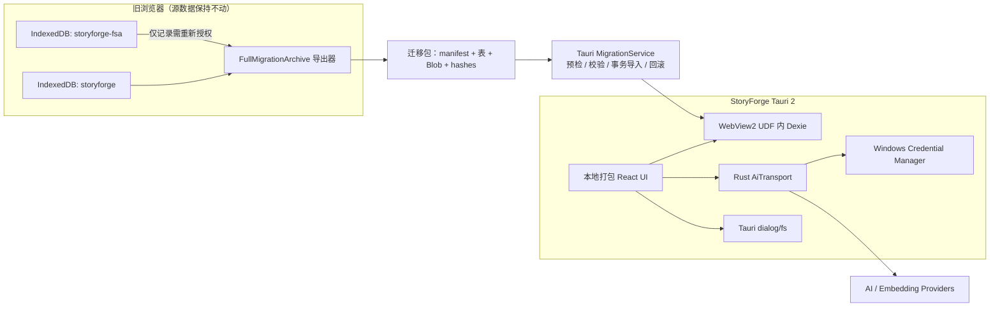

# StoryForge Windows 客户端化架构评估

## Meta

| 字段 | 值 |
| --- | --- |
| **评估日期** | 2026-07-14 |
| **评估模式** | Hybrid（现有代码库 + 项目文档 + Windows 桌面方案） |
| **系统阶段** | Web 版已生产使用；Windows 客户端处于规划/PoC 阶段 |
| **评估对象** | 当前代码库“可安全交付 Windows 客户端”的就绪度 |
| **总体评分** | **64.7% — Grade D** |

**上下文说明：** 本评估不是给现有 StoryForge 产品质量打分，而是评估它在今天是否已经具备“直接打成 Windows 安装包、自动迁移真实用户旧数据并公开发布”的条件。用户目标是 Windows 首发、先自用验证再公开发布，首次迁移由 Codex 执行而不是让用户手动搬文件。

---

## Executive Summary

### Overall Score: 64.7% — Grade D

```
Structural Integrity  ████████░░  4.0/5
Scalability           ███████░░░  3.5/5
Enterprise Readiness  █████░░░░░  2.5/5
Performance           ███████░░░  3.5/5
Security              █████░░░░░  2.5/5
Operational Excel.    ██████░░░░  3.0/5
Data Architecture     ███████░░░  3.5/5
```

### Top 3 Strengths

1. React 19 + Vite 6 + Dexie 4 都可直接运行在 Windows WebView2 中，UI 和大部分业务逻辑可以复用；无需重写成原生 UI。
2. PROJECT_TABLES、FIELD_REGISTRY/AdoptionSchema、CONTEXT_SOURCES 三个注册表，以及现有回归测试，为桌面迁移提供了清晰的数据边界和验证基础。
3. 项目已经具备 PWA、按需分块、完整 CI 和大量数据库回归测试，适合采用“共享 Web 核心 + 两个运行时适配器”的演进方式。

### Top 3 Critical Risks

1. **[S2] 现有项目 JSON 不是完整用户档案。** 它跳过 Blob、快照、用户 Prompt/Workflow、导入会话等数据，并存在已知数组/JSON 引用重映射缺口；直接使用无法满足零丢失。
2. **[S2] 现有 AI 网络和秘密存储不能原样进入桌面壳。** Vite 代理打包后不存在；API Key/PAT 可进入 renderer 的 Web Storage；桌面原生权限会放大 XSS 和任意网络出口的影响。
3. **[S2] Windows 发布链尚不存在。** 当前 Release 明确只发源码，没有 Windows 构建、安装包签名、更新签名、回滚恢复点和桌面迁移日志。

### Verdict

**值得做，推荐 Tauri 2，技术可行性明确；但不能把当前 dist 简单套壳后就称为客户端完成。** 最合适的目标架构是 Windows-first 的 Tauri 2 模块化单体：本地打包 React UI，继续使用 Dexie/IndexedDB，新增受控 Rust 网络桥、系统凭据存储、原生文件适配和完整迁移服务。不要在本次同时迁 SQLite，也不要复活“本地服务器 + 打开浏览器”的旧 exe 路线。

### 方案裁决

| 方案 | 结论 | 旧数据 | 适用场景 |
| --- | --- | --- | --- |
| 安装现有 PWA | 立即可用的过渡方案 | 与原网页同 origin 时可直接看到 | 立刻摆脱浏览器标签页 |
| **Tauri 2** | **正式客户端首选** | 首次需迁移；之后直接看到 | Windows 自用验证与后续公开发布 |
| Electron | 备选 | 同样需要迁移 | 只有 WebView2 出现不可接受兼容问题时再选 |
| 旧本地服务器 exe | 拒绝 | 仍占用浏览器并受 SW/端口影响 | 不符合本次目标 |

---

## Scorecard

| # | Dimension | Score | Weight | Weighted | Key Finding |
| --- | --- | --- | --- | --- | --- |
| 1 | Structural Integrity | 4.0/5 | 20% | 0.800 | 核心模块可复用，但浏览器能力尚未收口到运行时边界 |
| 2 | Scalability | 3.5/5 | 18% | 0.630 | 单机本地优先匹配目标，但缺少大书/Blob 容量基线 |
| 3 | Enterprise Readiness | 2.5/5 | 15% | 0.375 | 自用可行，公开分发所需签名、更新、兼容策略未建立 |
| 4 | Performance | 3.5/5 | 17% | 0.595 | WebView2 复用度高，但尚无与视频并行运行的实测基线 |
| 5 | Security | 2.5/5 | 18% | 0.450 | renderer 秘密、任意 Provider URL 和 CSP 需先收口 |
| 6 | Operational Excellence | 3.0/5 | 7% | 0.210 | Web CI 扎实，Windows 构建与客户端诊断缺失 |
| 7 | Data Architecture | 3.5/5 | 5% | 0.175 | Dexie/注册表成熟，完整档案迁移协议尚未实现 |
|  | **Overall** |  | **100%** | **3.235** |  |

### Score Calculation Verification

```
Structural Integrity:    4.0 × 0.20 = 0.800
Scalability:             3.5 × 0.18 = 0.630
Enterprise Readiness:    2.5 × 0.15 = 0.375
Performance:             3.5 × 0.17 = 0.595
Security:                2.5 × 0.18 = 0.450
Operational Excellence:  3.0 × 0.07 = 0.210
Data Architecture:       3.5 × 0.05 = 0.175
─────────────────────────────────────────────
Weighted Sum:                          3.235
Overall Percentage: 3.235 / 5 × 100 = 64.7%
Grade: D（60–69）
```

**Verification checklist：**

- [x] 权重合计：20 + 18 + 15 + 17 + 18 + 7 + 5 = 100
- [x] 每项 weighted = score × weight，保留 3 位小数
- [x] Weighted Sum = 3.235
- [x] 3.235 / 5 × 100 = 64.7%
- [x] 64.7% 对应 Grade D

---

## Detailed Findings

### 1. Structural Integrity & Design Principles — Score: 4.0/5

现有系统是结构清晰的本地优先模块化前端，桌面化不需要改变业务架构。主要缺口是浏览器能力、网络和存储环境判断仍散落在入口及具体功能中。

#### Findings

**[S3] 缺少稳定的 RuntimeAdapter 边界**

- **Evidence:** vite.config.ts:11-21、63 固定 /storyforge/；src/main.tsx:79 固定 BrowserRouter basename；src/lib/pwa/register-service-worker.ts:7-15 直接注册网页 SW；vite.config.ts:70-138 的 AI 代理只存在于 Vite dev server。
- **Impact:** Tauri 打包后可能出现资源路径、路由、SW、AI 请求和文件能力不一致；修复容易散落到各面板。
- **Recommendation:** 建立 RuntimeAdapter，至少包含 HttpTransport、FileTransport、SecretStore、ExternalLink、AppUpdate 和 Environment；Web/PWA 与 Tauri 各提供实现，业务组件只依赖接口。

**[S4] 旧 Windows exe 路线与本次目标不同**

- **Evidence:** docs/COLLAB-LOG.md:131-140 记录旧 exe/portable 已停止维护；docs/ROADMAP.md:649-660 说明旧实现本质仍依赖 localhost + 浏览器并受 Service Worker 影响。
- **Impact:** 若复活旧路线，用户仍然被浏览器、端口和 SW 状态占用，不能解决当前体验问题。
- **Recommendation:** 新客户端必须加载随安装包发布的本地 UI，不启动 Vite/Node/Go 本地服务器，也不自动打开外部浏览器作为主界面。

**[S5] 三注册表是桌面化的高杠杆基础**

- **Evidence:** src/lib/registry/project-tables.ts、FIELD_REGISTRY/AdoptionSchema、CONTEXT_SOURCES 及 tests/registry、tests/regression 已覆盖生命周期、AI 写回和上下文。
- **Impact:** 数据迁移和桌面适配可以集中实现，不必重写 70+ 面板。
- **Recommendation:** 保持注册表为事实源；桌面迁移包的表分类也应从 PROJECT_TABLES 派生，另增“权威/全局/Blob/可重建”迁移元数据，不手写第二份表清单。

---

### 2. Scalability — Score: 3.5/5

这是单用户、本地优先桌面应用，水平扩展、负载均衡和多租户数据库不适用。需要关注的是单机数据体量、长任务、磁盘容量和外部模型限流。

#### Findings

**[S3] 没有桌面容量包络与磁盘预检**

- **Evidence:** src/main.tsx:23-40 只请求 persistent storage；当前没有 navigator.storage.estimate、迁移包大小预检或磁盘余量门槛。
- **Impact:** 数百万字项目、参考资料 Blob 和迁移包可能在导入中途触发配额/磁盘错误；若无 shadow/rollback 会留下半迁移状态。
- **Recommendation:** 定义 10 万字、100 万字、500 万字，以及 100MB/1GB Blob 档位；迁移前检查归档大小、目标空间和 IndexedDB estimate；长任务显示进度并可安全取消。

**[S4] 可重建缓存需要明确容量策略**

- **Evidence:** src/lib/registry/project-tables.ts:199-207 将 retrievalChunks、narrativeSummaryNodes 标为 exportable:false。
- **Impact:** 全量携带会放大迁移包；完全省略又会造成首次启动长时间重建。
- **Recommendation:** manifest 显式列 omittedAsRebuildable；导入后按项目排队重建，允许暂停，且创作主路径在缓存未完成时仍可降级工作。

**[S5] 本地优先避免了服务端并发瓶颈**

- **Evidence:** 数据主路径是 React → Zustand → Dexie；AI 和 embedding 才访问外部 Provider。
- **Impact:** 自用和单机公开版不需要引入后端、Redis、队列或微服务。
- **Recommendation:** 保持模块化单体；只有未来真实出现多设备同步需求时，再单独评估同步服务。

---

### 3. Enterprise Readiness — Score: 2.5/5

用户当前是先自用，因此多租户、RBAC、HA、SOC 2/HIPAA/PCI/FedRAMP 均不适用。这里主要评估公开分发、兼容、恢复和供应商管理能力。

#### Findings

**[S2] 公开 Windows 发布链尚未建立**

- **Evidence:** .github/workflows/release.yml:24-38 只在 Ubuntu 发布源码，并明确“不再提供 .exe”；package.json:6-19 没有 Tauri 构建命令。
- **Impact:** 无法保证安装包来源、升级完整性、版本一致性和故障回退；公开发布会触发 SmartScreen 信任问题。
- **Recommendation:** 自用 MVP 后增加 windows-latest 构建、NSIS 安装包、Tauri updater 签名、Windows Authenticode、latest.json、哈希/SBOM；涉及 DB migration 的更新前自动生成恢复点。Tauri updater 的更新签名不可关闭，官方要求妥善保管私钥。

**[S3] “登录即见”目前不是系统能力**

- **Evidence:** 当前无账号、后端或同步协议；Gist 是项目快照备份，不是全档案或双向同步。
- **Impact:** 引入登录并不能读取从未离开浏览器的 IndexedDB；贸然做双向同步会引入 revision、冲突、tombstone、离线合并与持续运维。
- **Recommendation:** 首版明确为一次迁移 + 本地直接使用；后续如有真实需求，先做端到端加密整包快照，再评估增量同步，不把 Gist 自动备份描述为实时同步。

**[S5] Web 侧质量闸门可复用**

- **Evidence:** .github/workflows/ci.yml:15-44 已运行注册表检查、AI manual、架构检查、类型、覆盖率和构建。
- **Impact:** 新 Windows job 可在现有闸门之后构建，而不是另建一套质量流程。
- **Recommendation:** Windows artifact 只能在现有六项闸门全部通过后生成。

---

### 4. Performance — Score: 3.5/5

Tauri 2 在 Windows 使用系统 WebView2，避免随应用再打包一份 Chromium，方向上更符合“同时看视频、减少资源争抢”的目标。但目前没有真实桌面指标。

#### Findings

**[S3] 缺少“与视频并行”性能基线**

- **Evidence:** docs/MASTER-BLUEPRINT.md 的性能指标主要面向 Web 首屏；仓库无 Tauri 冷启动、工作集、CPU/GPU、输入延迟或长时内存基线。
- **Impact:** 仅凭包体或框架印象不能证明体感改善；WebView2 与视频同时使用 GPU 时仍可能抖动。
- **Recommendation:** PoC 必测冷/热启动、空闲工作集、编辑 10 万字章节、导入 1GB 参考资料、AI 流式期间 CPU/内存，并在 Edge 播放 1080p/4K 视频时测输入延迟和掉帧。

**[S3] AI transport 必须保持真正流式**

- **Evidence:** src/lib/ai/client.ts:195-222 使用 fetch + ReadableStream；tmp/tauri-poc/src-tauri/src/lib.rs:20-44 只返回一次性响应。
- **Impact:** 若 Rust 桥先缓存完整响应再返回，首 token 延迟、内存和取消体验都会退化。
- **Recommendation:** Rust 侧使用 reqwest 流并通过 Tauri Channel/Event 传增量 chunk；AbortSignal 映射到 Rust cancellation token；限制响应体、超时和重试。

**[S5] 现有按需分块可直接保留**

- **Evidence:** vite.config.ts 的 manualChunks，以及 pdfjs/mammoth/重面板的动态 import。
- **Impact:** 修正 desktop asset base 后无需重做前端性能工程。
- **Recommendation:** Web/PWA 与 desktop 分别产物构建，但共享 chunk 策略。

---

### 5. Security — Score: 2.5/5

桌面壳会把普通前端漏洞的影响放大到本机文件、凭据和更新能力，因此安全边界必须在自用阶段建立，不能等公开发布再补。

#### Findings

**[S2] renderer 秘密 + 任意网络出口组合风险**

- **Evidence:** src/stores/ai-config.ts:33-63、114-151 将 API/embedding key 放入 session/localStorage，预设也可保留 key；src/stores/gist.ts:29-60 保存 PAT；src/lib/ai/client.ts:150-200 从 renderer 发 Bearer 请求；自定义 baseUrl 未建立协议/host/redirect allowlist。
- **Impact:** 一旦 XSS 或不可信 UI 代码执行，可能读取手稿和密钥并发往任意地址；给 Tauri HTTP wildcard 会扩大影响。
- **Recommendation:** 密钥迁入 Windows Credential Manager，JS 只持 credentialId；Rust AiTransport 根据 Provider profile 取密钥并发请求。预设域名 allowlist；自定义 Provider 首次确认；只允许 HTTPS，HTTP 仅显式 loopback；拒绝 URL userinfo 和跨 host 携 Authorization redirect。

**[S2] 本地 UI、CSP 与原生权限必须绑定**

- **Evidence:** tmp/tauri-poc/src-tauri/tauri.conf.json:1 设置 csp:null；index.html 有 inline script/远端字体；当前 PWA 可从线上更新。
- **Impact:** 若客户端加载线上 Vercel UI，线上一次部署即可绕过客户端签名并获得原生权限；无 CSP 会放大脚本注入。
- **Recommendation:** 客户端只加载安装包内本地 UI；字体本地化；移除 inline script；配置严格 CSP；Tauri capabilities 只开放单主窗口所需的 dialog/fs/updater/opener，禁止 shell execute 和宽泛 fs/http 权限。

**[S3] 迁移包含完整手稿，需要保密和完整性控制**

- **Evidence:** 完整迁移会包含 42 张表、正文、Blob、Prompt/Workflow 和快照。
- **Impact:** 临时文件泄漏或被篡改会造成隐私与数据完整性问题。
- **Recommendation:** 包含逐表 SHA-256、Blob byte hash 和总 manifest hash；默认写用户选定目录并明确保留/删除；公开版增加可选密码加密。API Key/PAT 不进入普通迁移包。

**[S5] 当前默认 session-only 是正确基础**

- **Evidence:** AI key 和 PAT 只有用户显式选择“记住”才进入 localStorage；导出 HTML/SVG 已有清洗与回归。
- **Impact:** 桌面 SecretStore 可延续“用户显式授权持久化”的语义。
- **Recommendation:** 迁移旧 key 时同时清理 localStorage 及 presets 中的历史副本。

---

### 6. Operational Excellence — Score: 3.0/5

Web CI 和文档治理较强；桌面端缺少 Windows artifact、迁移诊断、更新可观测性和恢复操作手册。

#### Findings

**[S2] 客户端 CI/CD、签名与更新验证缺失**

- **Evidence:** 现有 CI/Release 均为 Ubuntu Web/源码流程；tmp/tauri-poc 还因 frontendDist 缺失而无法运行。
- **Impact:** 不能稳定复现安装包，也无法证明更新不会破坏 UDF/IndexedDB。
- **Recommendation:** 新增独立 Windows job：全闸门 → Rust/前端测试 → 安装包 → 签名 → 安装/升级 smoke → 发布。tag、package.json、tauri.conf 三处版本必须一致。

**[S3] 客户端诊断和迁移审计不足**

- **Evidence:** src/lib/ai/logger.ts 仅内存保留少量记录；ErrorBoundary 主要 console.error；没有持久 migration/update/crash 日志。
- **Impact:** 用户遇到启动、更新或迁移失败时难以定位，且不应收集正文或密钥。
- **Recommendation:** appData 下保留滚动结构化日志，只记录 app/schema/WebView2 版本、步骤、表计数、hash 结果和错误码；提供“一键导出诊断包”，默认不上传，不记录 prompt、正文、Authorization 或响应正文。

**[S5] 现有 CI 质量门较完整**

- **Evidence:** npm run ci 包含 required tables、AI manual、architecture、tsc、coverage、build。
- **Impact:** 桌面工作可以沿用相同完成定义。
- **Recommendation:** 增加 cargo fmt、cargo clippy、cargo test、Tauri capability/CSP 静态检查及 Windows WebView2 smoke。

---

### 7. Data Architecture — Score: 3.5/5

Dexie v37、42 张 required tables、注册表和迁移夹具是强基础。最大的桌面化缺口不是数据库选择，而是缺少“完整用户档案”的迁移协议。

#### Findings

**[S2] 现有 ProjectExportData 不能作为零丢失迁移协议**

- **Evidence:** 普通项目 JSON 已升级为 version 4，并用 `nestedRefEncoding: "export-index-v1"` 修复登记的数组/JSON 嵌套引用重映射；`R-export-nested-reference-remap` 与 D0.4 `small-v1` 已验证新主键下无悬空引用。旧 v1-v3 嵌套数字按 raw database ID 原样保留且不猜测。与此同时，`PROJECT_TABLES` 仍将可重建缓存、导入 Blob/会话、快照、全局 Prompt/Workflow 与 usage 标为 `exportable:false`。
- **Impact:** 普通 v4 项目分享 JSON 已消除 AUDIT-1b 的新导出引用缺陷，但仍不能覆盖完整资料迁移范围；把它直接当成零丢失全量迁移协议仍会静默遗漏这些非 exportable 数据，旧 v1-v3 也无法凭空推断嵌套 raw ID 的可移植映射。
- **Recommendation:** 新增独立 FullMigrationArchive，不替换普通项目分享 JSON。空目标库导入时保留原始主键；manifest 包含 app/schema/format 版本、逐表 count/hash、Blob size/hash 和 omittedAsRebuildable。

**[S3] 禁止物理复制 Chrome/Edge IndexedDB**

- **Evidence:** WebView2 使用宿主应用自己的 UDF 保存 IndexedDB；Chromium 的 IndexedDB backing store 按 origin 隔离，Blob 另存且带事务/恢复日志，并正在从 LevelDB 演进到 SQLite 实现。
- **Impact:** 复制 profile/LevelDB 会受到浏览器类型、多 profile、文件锁、内部版本和 Blob 一致性影响，可能破坏用户源库或目标库。
- **Recommendation:** 只通过旧网页同源代码调用正常 IndexedDB API 导出。Codex 执行首次导出和客户端导入；源浏览器库永不删除，客户端验证成功后才写 migration-complete。

**[S5] 数据安全测试资产可复用**

- **Evidence:** R-17-ensure-schema、R-db-upgrade-fixtures、R-export-import-roundtrip、R-05-delete-project-blob，以及 PROJECT_TABLES 引用规则。
- **Impact:** 可建立真实 Chrome/Edge → Tauri 的端到端闸门，而非只测假 IndexedDB。
- **Recommendation:** 增加逐表/正文/Blob hash、错误 profile、篡改包、磁盘满、中断、重复导入、autoIncrement、重启/升级/卸载保留测试。

---

## Cross-Cutting Concerns

### Multi-Dimension Issues

- **迁移协议横跨结构、数据、安全和运维。** 它必须先于真实用户启用客户端；失败需要全回滚并留下可脱敏诊断。
- **AI transport 横跨结构、性能和安全。** 既要支持 SSE/取消，又不能把密钥和任意网络能力暴露给 WebView。
- **稳定 app identifier/UDF 横跨数据和发布。** 一旦公开安装，修改 identifier 或 dataDirectory 可能让客户端“看起来数据消失”。

### Conflicting Design Decisions

- 当前 PWA 依赖 /storyforge/ base 和 Service Worker；desktop 需要根/相对资源路径并完全禁用 SW。
- 当前 Provider 支持任意自定义 URL；Tauri 最小权限要求受控网络 scope。需要 Rust 动态策略，而不是 wildcard HTTP 插件权限。
- 旧 Release 决策是停止 exe；本次是新的真实客户端项目，不应复用已废弃的本地服务器包装。

### Architectural Coherence Assessment

现有三注册表架构与 Tauri 并不冲突。只要把运行时差异收口到 adapter，产品仍是一个模块化单体，而不是“Web 一套、桌面一套”。不应复制面板或另建平行数据库。

### Requirements Alignment

- 若只解决“别占浏览器标签页”，安装现有 PWA 已满足并可直接使用旧数据。
- 若需要真正安装包、原生文件能力、系统凭据和未来自动更新，Tauri 2 更匹配。
- 用户接受首次导出/导入且要求 Codex 代办，因此首版无需先建设账号后端或 loopback 自动桥；应优先把完整迁移包做正确。

### Architecture Pattern Fitness

推荐模式：**本地优先模块化单体 + Tauri 2 原生能力边界**。Electron 只有在 WebView2 实测出现无法规避的渲染/文件/流式兼容问题时才作为备选。SQLite、云同步和跨平台均不应与 Windows 首版并行。



### Systemic Risk

**[S2] 最大系统性风险是把“桌面套壳、全库迁移、网络代理、秘密存储、数据库改型”合并成一次大改。** 这会让任何故障都难以定位，并把真实手稿置于不可回滚状态。控制方式是保留 Dexie、分阶段 vertical slice、先完成完整迁移和 hash 闸门，再启用真实用户库，最后才做公开分发。

---

## Recommendations — Prioritized

### Quick Wins（< 1 周）

| # | Recommendation | Addresses Finding | Expected Impact |
| --- | --- | --- | --- |
| 1 | 先将现有线上 PWA 安装为独立窗口，验证体验目标 | Performance / Requirements | 立即判断“标签页占用”是否已解决，且旧数据无需迁移 |
| 2 | 建 Tauri 2 Windows vertical slice：本地 UI、固定 identifier/UDF、打开一个假项目、编辑保存、重启恢复 | Structural / Data | 验证 React + Dexie + WebView2 基础兼容 |
| 3 | 建 RuntimeAdapter 骨架并让 desktop 构建禁用 PWA/SW、使用 desktop 路由/base | Structural | 阻止桌面条件判断散落 |

### Medium-Term（1–4 周）

| # | Recommendation | Addresses Finding | Expected Impact |
| --- | --- | --- | --- |
| 1 | 实现 FullMigrationArchive、完整 manifest/hashes、Blob 导出、空库保主键导入和回滚 | Data / Security | 达到 Codex 代办的零丢失迁移交付标准 |
| 2 | 实现 Rust 流式 AiTransport + Credential Manager + Provider/URL 策略 | Security / Performance | AI 可用且不暴露密钥/宽泛网络权限 |
| 3 | 实现 Tauri 文件对话框/目录备份适配，并把 FileSystemDirectoryHandle 标为需重新授权 | Structural / Data | 保持备份能力，不依赖 Web API 偶然兼容 |
| 4 | 建 Chrome/Edge 真实 profile → Tauri 迁移、长书容量和视频并行性能测试 | Data / Performance | 用实测决定能否进入自用 |

### Strategic（1–3 个月）

| # | Recommendation | Addresses Finding | Expected Impact |
| --- | --- | --- | --- |
| 1 | 建 Windows CI、NSIS、updater 签名、Authenticode、更新前恢复点和升级 smoke | Enterprise / Ops | 具备公开分发与可回退更新能力 |
| 2 | 严格 CSP、最小 capability、导航/外链 allowlist、诊断包和安全回归 | Security / Ops | 降低桌面原生权限的攻击面 |
| 3 | 公开版稳定后再评估端到端加密云快照；不直接做双向实时同步 | Enterprise / Data | 避免为“首次迁移”引入长期后端系统 |

### 建议工期（单人开发量级）

| 阶段 | 估算 |
| --- | --- |
| PWA 体验验证 | 0.5–1 开发日 |
| Tauri vertical slice | 3–5 开发日 |
| 完整迁移包 + 验证器 + 首启 UX | 8–12 开发日 |
| AI/秘密/文件运行时适配 | 5–8 开发日 |
| Windows 公开发布链与升级 QA | 5–10 开发日 |

“仅套壳 + 当前项目 JSON”可更快，但不满足本项目数据红线，不计为完成。安全自用版建议按约 3–4 周的工程量规划，公开发布再增加约 1–2 周。

---

## Appendix

### A. Files / Documents Reviewed

- CLAUDE.md
- docs/MASTER-BLUEPRINT.md
- docs/COLLAB-WORKFLOW.md
- docs/COLLAB-LOG.md
- docs/ROADMAP.md
- docs/ARCHITECTURE.md
- README.md
- package.json
- vite.config.ts
- src/main.tsx
- src/lib/pwa/register-service-worker.ts
- src/lib/db/schema.ts
- src/lib/db/ensure-schema.ts
- src/lib/registry/project-tables.ts
- src/lib/export/json-export.ts
- src/lib/export/registry-export.ts
- src/lib/storage/folder-backup.ts
- src/lib/storage/folder-handle-store.ts
- src/lib/ai/client.ts
- src/lib/ai/adapters/embedding-adapter.ts
- src/stores/ai-config.ts
- src/stores/gist.ts
- .github/workflows/ci.yml
- .github/workflows/release.yml
- tests/regression/R-export-fullcoverage.test.ts
- tests/regression/R-export-import-roundtrip.test.ts
- tests/regression/R-db-upgrade-fixtures.test.ts
- tests/regression/R-17-ensure-schema.test.ts
- tmp/tauri-poc（仅作为失败 PoC 证据，不视为正式实现）

官方技术依据：

- [Tauri + Vite](https://v2.tauri.app/start/frontend/vite/)
- [Tauri Capabilities](https://v2.tauri.app/security/capabilities/)
- [Tauri CSP](https://v2.tauri.app/security/csp/)
- [Tauri Updater](https://v2.tauri.app/plugin/updater/)
- [Tauri HTTP Client Scope](https://v2.tauri.app/reference/javascript/http/)
- [Microsoft WebView2 User Data Folder](https://learn.microsoft.com/en-us/microsoft-edge/webview2/concepts/user-data-folder)
- [Microsoft Edge PWA 本地存储](https://learn.microsoft.com/en-us/microsoft-edge/progressive-web-apps/how-to/offline)
- [Chromium IndexedDB backing store](https://chromium.googlesource.com/chromium/src/+/master/content/browser/indexed_db/docs/README.md)
- [Electron Process Model](https://www.electronjs.org/docs/latest/tutorial/process-model)
- [Electron Security](https://www.electronjs.org/docs/latest/tutorial/security)

### B. Assumptions Made

- 第一版仅 Windows。
- 先由项目作者自用验证，再公开发布。
- 现有浏览器数据必须保留；首次迁移由 Codex 执行。
- 公开版第一阶段仍是单用户、本地优先，不建设多人协作。
- 当前最大/典型 IndexedDB 和 Blob 体量未知，因此容量建议采用保守档位。

### C. Out-of-Scope Items

- 本轮未修改产品代码、未打包安装器、未启动浏览器/桌面自动化。
- 未执行真实 AI Provider 调用。
- 未测量当前机器上的内存、GPU、冷启动和视频并行指标。
- 未设计账号、计费、多人协作或实时多设备同步。
- 未进行依赖 CVE/许可证全量审计。

### D. Sub-Criteria Marked Not Applicable

- 水平扩展、负载均衡、数据库副本/分片：单用户本地桌面应用不适用。
- 多租户、RBAC/ABAC、企业 HA/SLA：Windows 自用首版不适用。
- SOC 2、HIPAA、PCI-DSS、FedRAMP：当前需求未声明相关处理场景。
- 分布式追踪、消息队列、Saga/CQRS：单进程模块化单体不适用。

### E. Methodology

本评估使用 Architecture Reviewer 框架，按 7 个维度评审，严重度只使用 [S1]–[S5]，评分只使用 1–5。总体分数按固定权重计算：Structural Integrity 20%、Scalability 18%、Security 18%、Performance 17%、Enterprise Readiness 15%、Operational Excellence 7%、Data Architecture 5%。未调整权重。

模板校验：

- [x] 七个维度均有分数、证据、影响、建议和至少一项优势
- [x] 严重度仅使用 [S1]–[S5]
- [x] 分数使用 1–5，含有理由的半分
- [x] 权重、加权值、总分、百分比和 Grade 已复算
- [x] 包含跨维度冲突、架构一致性、需求匹配、模式适配与系统性风险
- [x] 建议分为 Quick Wins、Medium-Term、Strategic
- [x] 附录包含文件、假设、范围外项、N/A 与方法


